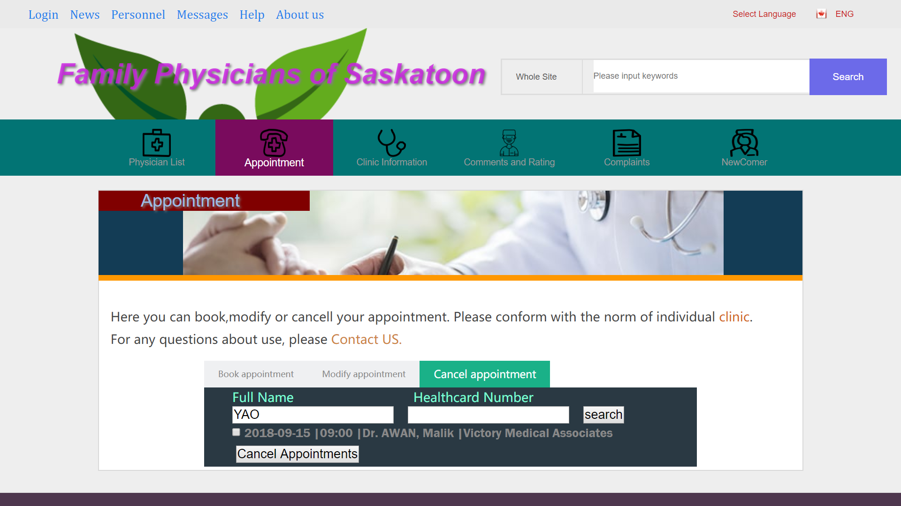
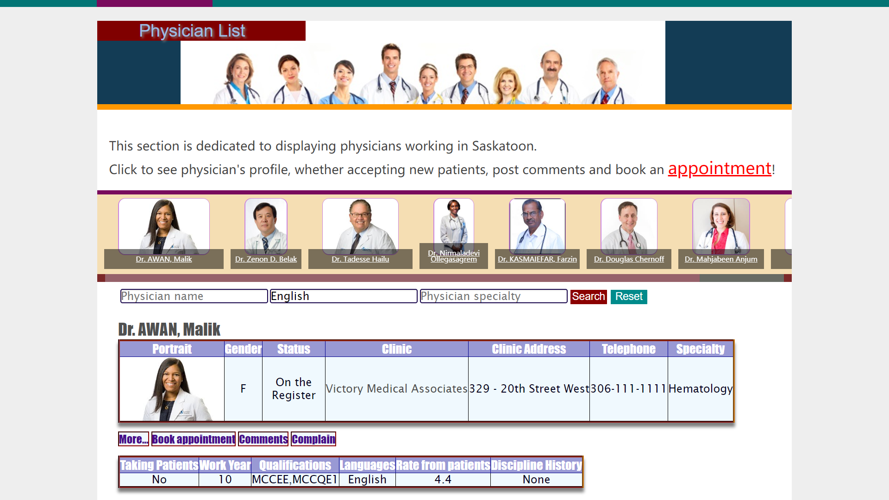
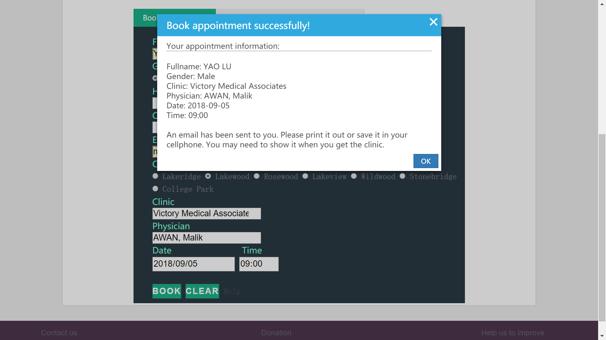
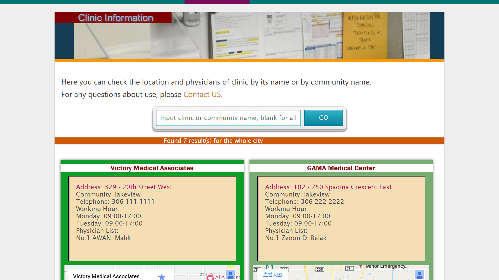

#York's project

* This project is for my ComIT class held in Saskatoon from Jun to Sep of 2018.
* It's designed for residents of Saskatoon to browse, book/modify/cancel appointment with and evaluate the family physicians.
* It's deployed in Heroku, http://immense-badlands-64622.herokuapp.com/

* In PHYSICIAN LIST page, you can browse the profile of physicians and jump to his/her clinic page. You can also book appointment if you think the physician is suitable for your condition, the name of such physician and clinic will be filled in appointment form automatically.

* In APPOINTMENT page, you fill your information then press BOOK. A confirming Email will be sent to you immediately after your sumbit. A reminding Email will be sent one day to user one day before their appointing days! Users can browse and cancel/modify their appointments.

* In CLINIC INFO page, you can leave the searching bar blank to search all the clinics, input the name of clinic or your community to specify the result. A embeded google map can help you see the location clearly.

* Some pages are still under construction...
* Skills included in: HTML5, CSS, JS, jQuery, Ajax, MongoDB, google developer API, npm(express, nodemailer, node-schedule, assert...), VS CODE extensions.
